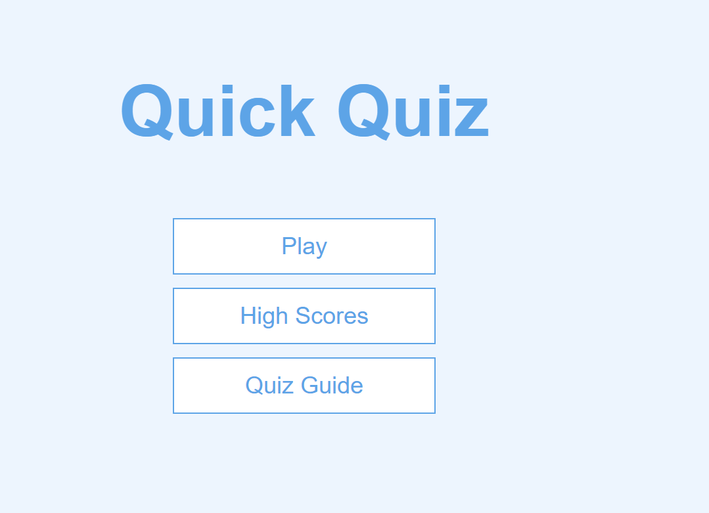
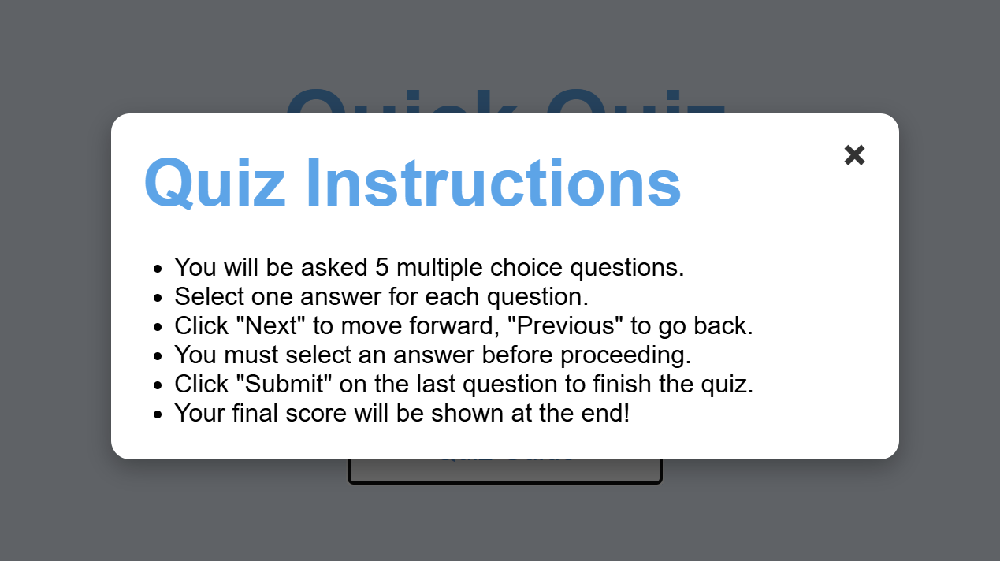
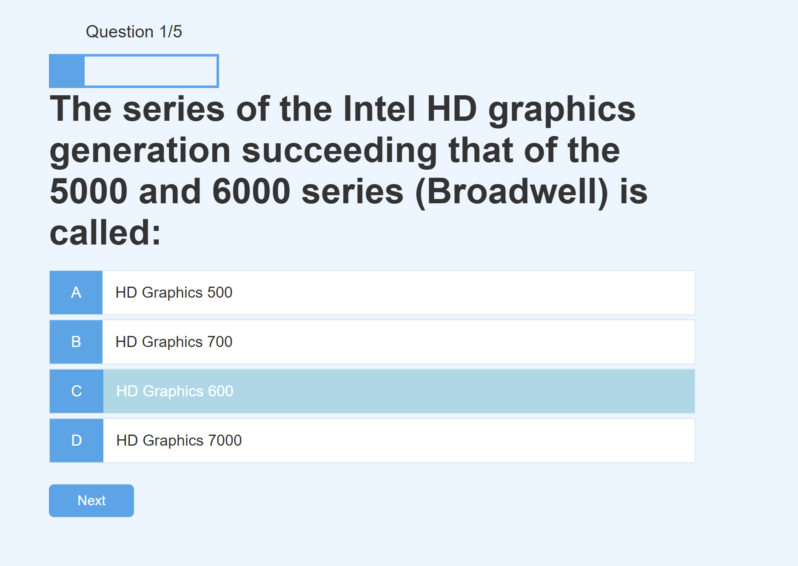
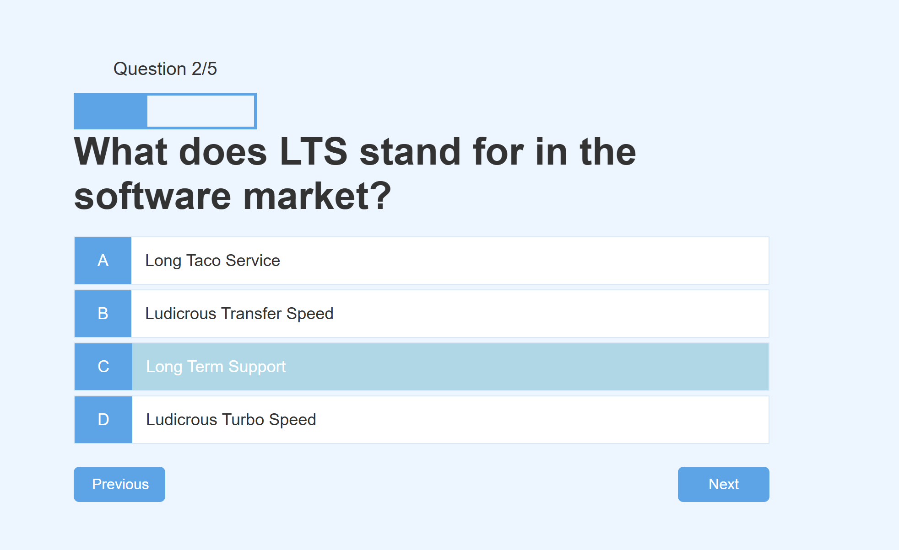
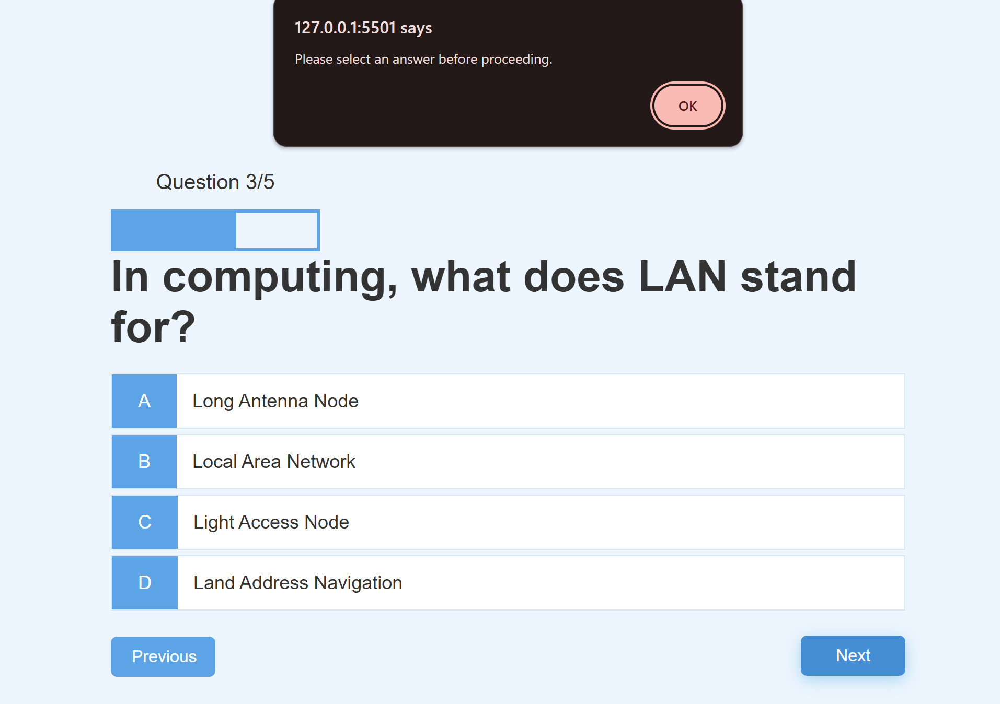
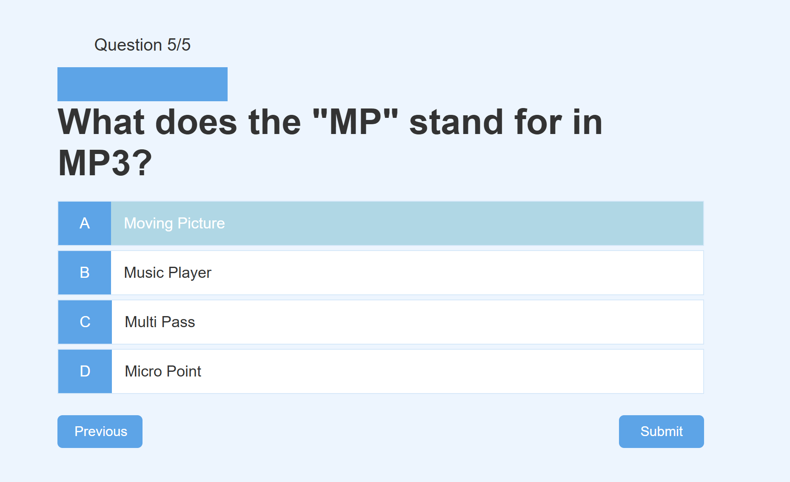
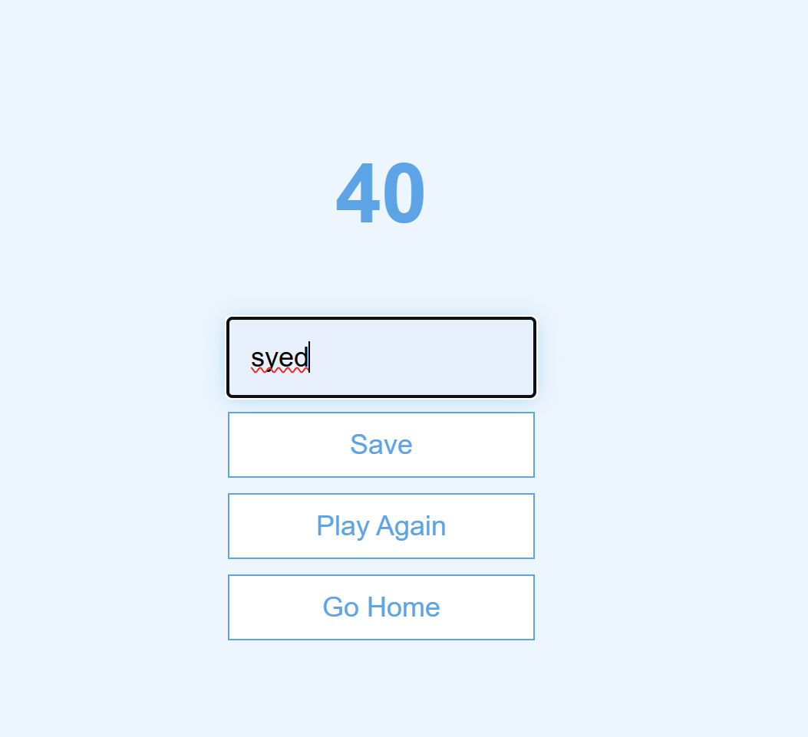
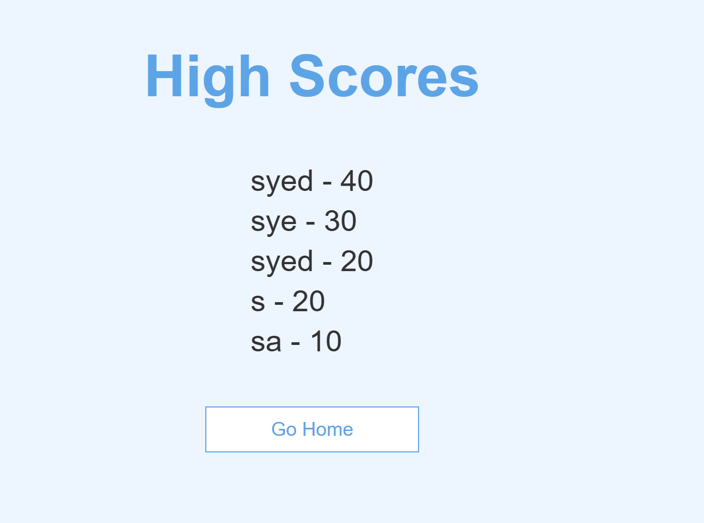

## Overview

Welcome to my online quiz project. A simple, interactive quiz web application built with HTML, CSS, and JavaScript. Users can test their knowledge, view their final score and save high scores using local storage.

The website can be accessed by this [Link](https://syedkazmidev.github.io/quiz-project/)

## Features

<h3>The website exists on multiple pages with multiple features visible to the user and responsiveness:</h3>

- first page is main page
 

- Next is the quiz guide pop-up.
 

- Then when you click start quiz it has the below functions. 
- The chosen answer is highlighted in a different color to differentiate from the other multiple choices to allow user to see clearly what was selected.

- The second feature shows the previous button after the 1st question is done.
 

- Another feature shows an error message when nothing is selected.
 

- The last quiz shows the next button has changed to a submit button.
 

- Once submitted, the score page will be displayed and user can either type name and save score, start again or got to home page.
 

## Technologies Used

- HTML- was used as the foundation of the site.
- CSS- was used to add the styles and layout of the site.
- Javascript- was used to create all the logic and visuals necessary for quiz.
- VScode- was used as the main tool to write and edit code.
- Git- was used for the version control of the website to push and commit.
- Github- was used to host the code of the website.